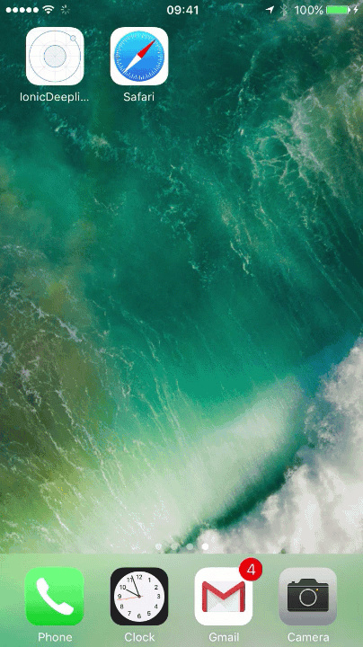

# IonicDeeplinkTest

Ionic framework **1** demo app that shows how to use deeplinking with Ionic Native Deeplinks plugin.

The step by step tutorial is published and you can, of course, check it out for free: [How to use deep linking in Ionic 1 apps with Ionic Native Deeplinks plugin](http://www.nikola-breznjak.com/blog/javascript/ionic/use-deep-linking-ionic-1-apps-ionic-native-deeplinks-plugin/).

Here's a gif of how it looks/works:
